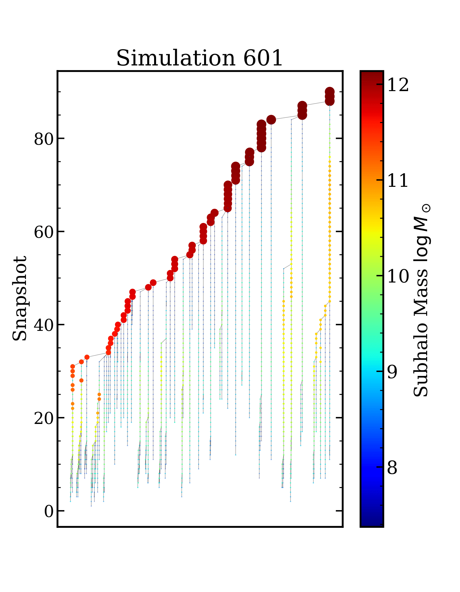

# Merger Tree Graph Neural Network 



## Overview
This repository contains the code used in Leisher et al. 2025 to train a Graph Neural Network (GNN) on merger tree histories taken from a cosmological simulation suite within DREAMS. The codes first load subhalo data features from merger trees in Milky Way zoom-in simulation boxes in the DREAMS database. Then this data is converted into a Graph object using [PyTorch](https://pytorch-geometric.readthedocs.io/en/latest/), and finally a GNN is trained on these Graphs to infer simulation parameters. Both directories ```gnn``` and ```data``` have their own README files that explain how to run the scripts.

## Required Dependencies
Here are the libraries required for running the codes:
- ```numpy```
- ```matplotlib```
- ```h5py```
- ```optuna```
- ```torch```
- ```scipy```
- ```torch_geometric```
- ```torch_scatter```
- ```xgboost```
- ```sklearn```
- ```random```
- ```pickle```

## Note
These scripts are all set up to be run specifically on the Rivanna HPC cluster with data from the DREAMS SB4 WDM MW zoom-in simulation suite. These scripts could be adapted to run either on different suites within DREAMS, different simulations altogether, or with different HPCs, but in general, they are not meant to be used without HPC or simulation suites. Please feel free to reach out to ilemleisher@gmail.com with any questions about usage or adapting the codes.

If you use this code, please link this repository and cite https://arxiv.org/abs/2511.05367.
